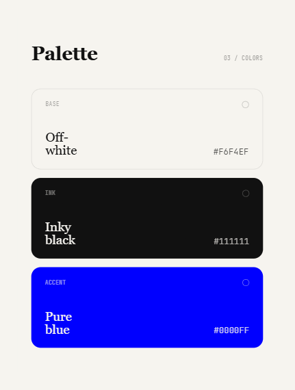

# Personal Portfolio

Author: corinna buzzi

Link: corinnabuzzi.github.io/portfolio — not deployed yet.

Personal portfolio site. Built from scratch with vanilla HTML, CSS, and JavaScript — no frameworks, no build tools.

## Structure
```
├── index.html
└── styles.css
```

## Stack

- HTML/CSS/JS — no dependencies


## Changelog

### v0 — Basic structure

**index.html**

- Basic page structure: `<header>` with name, title (blue), intro text, empty `<main>`
- No footer or navigation yet

**styles.css**

- background, fonts (`fonts-size: 18px`, `line-height: 1.7`)
- centered container (`max-width: 750px`, `padding: 60px 30px 40px` — will probably be changed)
- Fonts: Inter (name — 700 weight, 48px) + Lora (intro text — 20px, `max-width: 650px`)

### v0b — Footer added

this version was all about experimenting and finding out inspiration. Some important design decisions made here (link)

**index.html**

- added `<footer>`: github, linkedin, contact (prob future mailto: implementation)

**styles.css**

- footer styles: `margin-top: 100px`, inter, blue, underline on hover 

### v0c — content sections

**index.html**

- 2 `<section>` blocks: "selected projects", "about"

**styles.css**

- `.section`: `margin-bottom: 80px`; `.section-label`: inter, 12px; `.section-divider`: `margin-bottom: 40px`
- `.separator`
- `about-content p`

---

### v1 — complete redesign

here I found out more direction in terms of design.

**index.html**

- scrapped old container-header-main-footer structure for new structure:

**styles.css**

- body: left-aligned, vertically centered full-viewport; flexbox column;
- same fonts; name: 52px inter 700 in #111; role: 18px inter 400 in #0000ff; subtitle: 17px lora

---

### v2 — footer

**index.html**

- fixed footer with links (same as before)

**styles.css**

- `.contact-links`: Inter 13px, 600 weight, 1.2px letter-spacing, uppercase
- `.contact-links a`: dark by default, blue on hover
- `.separator`: gray, `margin: 0 10px`

---

### v3 — mono block 

**index.html**

- new font! jetbrains mono
- textblock in mono font with words 'parsing natural language, .morphology, mapping syntax tree -> found (linguistics, cs) resolve \[my-name]' i thought this was super cheeky — todo: remove / change / find alternative

**styles.css**

- `.mono-block`: JetBrains Mono 13px, `line-height: 2`, `margin-bottom: 28px`, gray (`#bbb`) by default, `.blue` tokens in `#0000FF`

---

### v4 — full animation sequence!

**index.html**

- static mono block removed from HTML, now generated by JS into `<div id="mono-lines">`
- added `id:"tagline"` as js target
- footer removed, added nav, links added to nav
- `<nav class="hp-nav" id="nav">`

**styles.css**

- body gets `positive: relative`
- nav! `position: fixed`, `top: 40px`, `right: 64px`, starts `opacity: 0`, fades in via `.visible` class; links Inter 13px 600 weight uppercase with 1.2px letter-spacing
- `.hp-mono`: starts invisible (`opacity: 0`, `translateY(4px)`), animates in via `.visible`; `.blue` and `.dim` token classes
- `.hp-name`: starts clipped (`clip-path: inset(0 100% 0 0)`), reveals via `.revealed` with `cubic-bezier(0.16, 1, 0.3, 1)`
- `.hp-role-wrap`: fixed height 28px, `overflow: hidden`; role slides in/out via `.visible` / `.exit`
- `.hp-tagline`: starts `opacity: 0`, fades up via `.visible`
- `.hp-cursor`: blinking blue cursor (2px wide, `step-end` animation)

---

## Design overview

### Palette



**Background**: warm off-white, papery
**Text**: near-black, inky-looking. 
**Accent**: pure blue. i love it, and it really works when used sparingly
